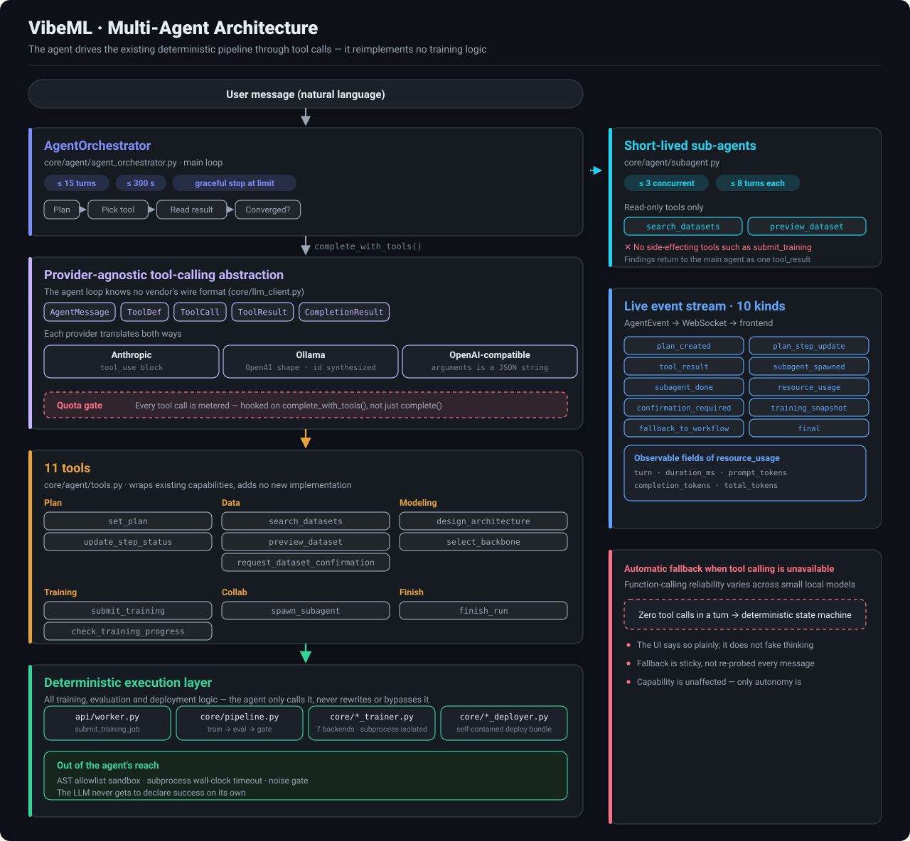

<div align="center">


# VibeML

### One sentence + a few dozen samples = a deployable model
### **And it tells you whether that model is actually any good**

<p>


</p>

<p><a href="README.md">简体中文</a> · <b>English</b></p>

</div>

---

## 30 seconds

<table>
<tr>
<td width="50%" valign="top">

### 😣 What you do today

1. Find an ML engineer, wait two weeks
2. Explain the business need, iterate on it
3. Receive an accuracy number in a spreadsheet
4. Have no idea whether that number is trustworthy
5. Ship it and find it worse than the test said

</td>
<td width="50%" valign="top">

### ✨ With VibeML

1. Open the page, describe the task in plain words
2. Paste a few dozen samples
3. Watch it train, diagnose and adjust itself
4. **Every metric carries a confidence interval and a real/noise verdict**
5. Download the bundle, run `python inference.py`

</td>
</tr>
</table>

---

## Who it's for

| Your situation | What VibeML does about it |
|---|---|
| **No ML team** | Describe the task in natural language; the system asks for what's missing. No feature engineering or hyperparameter knowledge required |
| **Only a few dozen labels** | Built for 10–200 per class, not a scaled-down big-data tool (mainstream AutoML typically suggests 1,000 rows as a floor) |
| **Data can't leave your network** | Runs fully on local Ollama, zero external API calls, can be packaged as a desktop app |
| **Chinese business data** | Chinese-first, not a translated English tool (see the measurement below: default tokenization simply fails on Chinese) |
| **Burned by inflated accuracy before** | Every conclusion comes with a noise level; when a difference is indistinguishable, it **says so** |

---

## On small data, most "improvements" are noise

> This is the project's foundation, and the hardest part to copy.

You tuned a model and accuracy went from 70% to 75%. **Should you ship it?**

If your validation set has 20 samples — you cannot know. At that size the binomial standard error is **±10.2%**; 70% and 75% fall inside the same confidence interval and are statistically the same number. What you saw may be nothing more than a different random seed.

The problem is that nearly every AutoML system and LLM agent treats those 5 points as a real gain, then keeps deciding on top of it: adopt this change, continue in this direction, report the task as done. **Error compounds from there.** Statistics has a name for it — the winner's curse: pick the highest score among many configurations and the winner necessarily carries luck with it, which evaporates in production. The smaller the dataset, the harder the fall.

And small data is exactly what most real business settings look like — a few dozen labels, one afternoon, no algorithms team.

> ### VibeML reverses the order: first decide whether a conclusion is trustworthy, then decide whether to adopt it.

Others optimize the score. This optimizes **the credibility of the conclusion**.

| | Typical AutoML / agent | VibeML |
|---|---|---|
| Reported metric | A single number | Number + confidence interval + **a verdict on whether the change is real** |
| Iteration decision | Adopt whatever scores higher | Adopt only above the noise floor; **otherwise state plainly "no improvement"** |
| Small data | Silently reports an optimistic estimate | Switches to cross-validation and reports the noise level |
| Chinese | Mostly English-first; Chinese degrades silently | Switches to character n-grams by CJK ratio (measured below) |
| Barrier to entry | Requires knowing features, models, hyperparameters | Describe the task in plain words |

### Why competitors won't follow

This is not a technical moat but an **incentive mismatch** — and incentive mismatches are harder to cross than technical ones:

- **Cloud platforms** (Vertex / SageMaker / PAI / ModelArts) bill for compute and training hours. "You don't have enough data, don't train yet, go label 300 more" works directly against that business model.
- **Leaderboard agents** (AIDE, MLE-STAR and friends) optimize for competition scores, which is the winner's curse taken to its limit.
- **Enterprise platforms** (DataRobot, H2O) serve customers who already have data science teams and run their own significance tests.

A product that says "this result isn't trustworthy, don't ship it" demos badly — which is precisely why it is hard to imitate.

---

## See it run

<div align="center">

</div>

Conversation on the left, live training on the right with **per-iteration attribution**. Note that the diagnosis is actionable rather than generic (the UI is Chinese-first; this is a real run):

> **Iteration 1 · 42.9%** — the model is a yes-man: it saw too few negative examples in training, so it guesses "positive" for everything.
> **Iteration 2 · 69.2%** — suggests adding at least 40 more samples to the "negative" class, weighting it 3.0, **and switching to the `weighted_ce` loss**.

In this actual run, iteration 3's single-split metric rose to 76.9%, but 5-fold cross-validation showed `73.1% → 70.8%`, so the system declared **"no improvement"** and stopped. That is the noise gate doing its job.

---

## Quick start

```bash
# 1. Install (core, ~200MB — enough for the full conversation flow + sklearn backend)
pip install -r requirements.txt

#    For neural / RL / vision backends (~3GB)
#    pip install -r requirements-nn.txt

# 2. Run it on a local model (free, recommended) — install Ollama and pull one
ollama pull qwen3:30b

# 3. Start
python -m uvicorn api.main:app --port 8000
```

Open <http://localhost:8000> and describe your task in the chat box, for example:

> Build me a hotel-review sentiment classifier that tells positive from negative

The system asks for whatever is missing (where the data comes from, which backend, how many iterations) and starts once it has enough.

<details>
<summary><b>Don't want a local model? Four LLM sources are supported</b></summary>

| Source | Notes |
|---|---|
| **Ollama** | Local and free, no network needed, private data never leaves your network |
| **OpenAI-compatible** | Self-hosted vLLM / LM Studio, or any compatible endpoint |
| **Anthropic** | Bring your own API key |
| **System-managed** | Use the platform quota after signing in; metered per call with an auditable usage log |

Switch under Settings → Config in the top-right. The choices are mutually exclusive and credentials are isolated.
</details>

<details>
<summary><b>Command line</b></summary>

```bash
python run.py \
  --task "Sort support tickets by issue type: account, payment, shipping, product quality, other" \
  --data examples/data/customer_tickets.jsonl

# Predict with the trained model
python run.py --demo --predict "Payment went through but the order says unpaid"
```
</details>

---

## Core capabilities

### 🎯 Trustworthy evaluation — the foundation of this project

`core/robust_eval.py` attaches a zero-cost analytic noise floor to every metric:

```
binomial standard error  σ = √(p(1-p)/n)
n=20, p=0.7  →  σ = ±10.2%   # 70% and 75% are indistinguishable
```

A change must exceed **1σ** to be adopted. Measured behaviour on a real Chinese dataset:

```
150 training samples : 66.0% ±8.6%  (5-fold CV)
600 training samples : 75.5% ±3.9%  (5-fold CV)

[real gain]  600 vs 150        → ✅ judged real   (+9.5% > ±3.9%)
[null test]  same data, reshuffled → ✅ judged noise (+0.8% < ±8.6%)
```

It recognizes real gains and refuses to call a reshuffle progress. With enough samples it switches to 5-fold cross-validation, with the vectorizer inside the Pipeline so per-fold vocabulary cannot leak.

### 💬 Conversational task clarification

No need to know "feature engineering" or "hyperparameter search". When the description is incomplete the system asks one thing at a time; when everything is supplied up front it starts immediately without redundant questions.

### 🔁 Automatic iteration and attribution

After each round an LLM diagnoses the result and gives **actionable** advice, not platitudes. The diagnostic signals come from real per-class F1 and confusion pairs, not from thin air.

### 🧩 Seven backends, one conversation

| Task | Backend |
|---|---|
| Text classification | sklearn / pretrained fine-tuning / **LLM-generated classification head** |
| Reinforcement learning | LLM-generated Gym environment + stable-baselines3 |
| Instruction tuning | Any HF causal LM + LoRA |
| Image classification | CLIP-style vision encoder + classification head |
| Captioning / VQA | End-to-end fine-tuning (BLEU / ROUGE-L drives the loop) |

Text classification ships with a three-tier fallback chain: `custom_nn → pretrained_nn → sklearn`. When a tier fails it falls back automatically instead of failing the whole task.

### 🛡️ Safety boundary for LLM-generated code

`custom_nn` and RL environments are generated by an LLM and **actually executed**, so there are three lines of defence:

1. **AST allowlist static gate** (`core/nn_sandbox.py` / `core/rl_sandbox.py`): no dangerous builtins, no dunder escapes, restricted imports
2. **Subprocess isolation** (`core/subprocess_runner.py`): `spawn`ed process + wall-clock timeout + terminate→kill escalation
3. **Only audited training libraries are trusted**: sklearn / transformers / stable-baselines3. The LLM produces structure definitions only and never touches the training algorithm itself

### 🀄 Chinese is not a second-class citizen

A far-reaching bug was fixed here: sklearn's default `token_pattern` splits on whitespace, so **a whole Chinese sentence becomes a single token**, no two samples share a feature, and the model degenerates into a lookup table.

Measured on a real dataset (`Chinese_sentiment`, 1,000 rows, 5-fold f1_macro, 1σ≈0.015):

| Tokenization | f1_macro |
|---|---|
| default word(1,2) | **0.388 ±0.000** ← zero fold variance, i.e. always predicting the majority class |
| **char(1,3) (current)** | **0.629** ±0.041 |

It now switches automatically by CJK character ratio; the English path is unchanged parameter for parameter.

### 🔌 Engineering around it

- **Accounts**: sign-up / sign-in, Google OAuth, JWT, per-call metered LLM usage auditing
- **API service**: long-lived API tokens, each carrying its own provider configuration; API-initiated conversations are viewable read-only in the web UI
- **Attachments**: PDF / Word / Excel / Markdown / images / archives, with drag-and-drop and paste-to-attachment
- **Compute resources**: configure and test Slurm / Kubernetes connections (⚠ that's as far as it goes — training still runs locally, see "Known limitations")
- **Artifact export**: one-click download of the model bundle and the code bundle

---

## Architecture

```
User conversation
   │
   ▼
core/conversation/        Orchestration: clarify → data → model → config → train → report
   │                      (Multi-agent driven; falls back to a deterministic
   │                       state machine when tool calling fails)
   ▼
core/pipeline.py          Iteration loop: train → evaluate → noise gate → diagnose → adjust
   │                          │
   │                          ├── core/robust_eval.py      cross-validation + noise floor
   │                          ├── core/explainer.py        LLM attribution and advice
   │                          ├── core/loss_factory.py     loss selection by error pattern
   │                          └── core/augmentor.py        out-of-fold mislabel detection
   ▼
core/*_trainer.py         7 backends, all isolated through subprocess_runner
   ▼
core/*_deployer.py        Self-contained deploy bundle (weights + inference.py + README)
```

The frontend `web/index.html` receives training events over WebSocket; `web/app.js::reduceEvent` handles state reduction (covered by 30 unit tests).

### The multi-agent layer

Conversation is driven by an agent main loop that **reimplements no training logic** — it only drives the unchanged deterministic pipeline below through tool calls.

<div align="center">
  <picture>
    <source media="(prefers-color-scheme: dark)"  srcset="assets/arch-multiagent-en-dark.svg">
    <source media="(prefers-color-scheme: light)" srcset="assets/arch-multiagent-en-light.svg">
    
  </picture>
</div>

#### Five key design decisions

**1. Provider-agnostic, locked to no vendor**
The agent loop only manipulates its own `AgentMessage` and never learns what Anthropic's `tool_use` block or OpenAI's `tool_calls` look like. Each provider handles the two-way translation itself. All three implement `complete_with_tools()`, so **a local Ollama model can run the full agent flow** — this is not an Anthropic-only capability.

**2. The agent never judges success, it only calls and reads**
`submit_training` calls the very same `api/worker.py::submit_training_job` the web path uses; `check_training_progress` only reads fields actually measured into `task_store`. **The LLM never gets to decide "that counts as success"** — sandbox validation, subprocess timeouts and the noise gate all run where the agent cannot reach, and it has no path around them.

**3. Suspend-and-resume instead of blocking**
When user confirmation is needed (before really downloading an external dataset, say), the agent emits the confirmation card, stores `agent_pending_action` and `agent_transcript` on the conversation state, and **ends the call**. The next message restores the tool-call history from the transcript and continues. This also holds up under multi-process deployment and leaks no suspended coroutines.

**4. Short-lived sub-agents with a restricted toolset**
For parallel investigation the main agent spawns sub-agents (`MAX_CONCURRENT_SUBAGENTS=3`, each `≤8` turns). Sub-agents receive **read-only tools** (`search_datasets` / `preview_dataset`) and explicitly none with side effects such as `submit_training`; their findings return to the main agent as a single `tool_result`.

**5. Automatic fallback when tool calling is unavailable**
Function-calling reliability varies across small local models. After a turn with zero tool calls, the system falls back to the deterministic state machine to finish the job and **says so plainly** in the UI rather than pretending to think. The fallback is sticky — once this model is known not to emit tool calls, there is no point rediscovering that at a dozen calls per message.

#### Observability

Every step pushes an `agent_event` to the frontend, across 10 kinds: `plan_created`, `plan_step_update`, `tool_result`, `subagent_spawned`, `subagent_done`, `resource_usage`, `confirmation_required`, `training_snapshot`, `fallback_to_workflow`, `final`.

`resource_usage` carries `turn` / `duration_ms` / `prompt_tokens` / `completion_tokens` / `total_tokens`, and the resource bar at the top of the UI shows in real time **what each agent is doing, how long it took and how many tokens it burned**.

#### Extensibility

- **MCP**: `core/agent/mcp_client.py` connects to any MCP server through the official SDK's streamable-HTTP client, and those tools rank equally with the built-ins. Each connection owns one asyncio Task (the SDK's `ClientSession` manages its read/write coroutines with an anyio TaskGroup, so cross-task calls break); an unreachable server is skipped rather than taking the agent down.
- **Skills**: built-in skills in `core/agent/skills.py` are appended to the system prompt as text and enabled per user in settings.

#### Cost

In multi-agent mode a single user message can trigger up to 15 LLM calls (the deterministic flow usually makes one). That is the price of autonomy — which is why **the quota gate hooks `complete_with_tools()` and not just `complete()`**; otherwise a system-managed user could run a dozen-turn tool loop unmetered. With a local Ollama there is no cost at all.

---

## Known limitations

This section is not a to-do list. These are facts **as of today**, written down so you don't use the system on wrong expectations.

| Limitation | Detail |
|---|---|
| **Training always runs locally** | Slurm / K8s can currently only be configured and connection-tested; jobs are **not actually submitted remotely**. The remote entry point, job script generation and event callback are not wired up |
| **Publishing to HF / ModelScope / GitHub is not implemented** | The design contract is settled (private by default, explicit confirmation each time, backend rejects requests without a confirmation flag) but the code is not written |
| **Hard-example mining is unproven** | Targeted selection measured **+0.008**, below the 1σ noise floor of 0.011, with the sign flipping across seeds. Only hard-example *diagnosis* and zero-cost deduplication are kept; no over-generation |
| **Credentials are stored in plaintext** | `ApiToken.llm_api_key`, and `ComputeResourceProfile`'s kubeconfig / SSH private key (they must be reversible to actually be used). For production, move to a secret management service |
| **Slurm uses AutoAddPolicy** | Host keys are not verified on first connect, which is theoretically open to a man-in-the-middle |
| **Export downloads have no extra authorization** | Anyone with the `task_id` (a UUID) can download artifacts, consistent with existing endpoints |
| **sklearn "epochs" are simulated** | The learning curve is simulated by progressively increasing the training fraction, not real gradient-descent epochs. Neural backends have real epochs |

---

## Requirements

- Python 3.10+
- No GPU required (the sklearn path is pure CPU; neural backends support Apple MPS / CUDA and fall back to CPU)
- LLM: a local Ollama is enough, no paid API needed
- Optional: PostgreSQL (only when the account system is enabled)

---

## Author

**Zhongjiang Yao**

## License

Released under the [MIT License](LICENSE).
