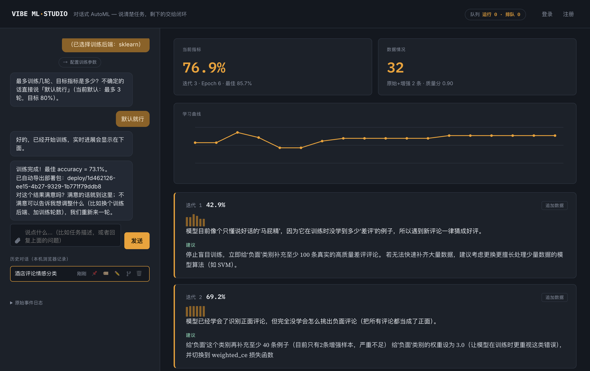

<div align="center">


# VibeML

### 一句话 + 几十条样本 = 一个能上线的模型
### **而且它会告诉你，这个模型到底行不行**

<p>


</p>

</div>

---

## 30 秒看懂

<table>
<tr>
<td width="50%" valign="top">

### 😣 你现在要做的

1. 找算法工程师，排期两周
2. 解释业务需求，来回对齐
3. 等一个 Excel 里的准确率数字
4. 不知道这个数字可不可信
5. 上线后发现没有测试时那么好

</td>
<td width="50%" valign="top">

### ✨ 用 VibeML

1. 打开网页，用大白话描述任务
2. 粘贴几十条样本
3. 看着它自己训练、诊断、调整
4. **每个指标都带置信区间和真伪判定**
5. 下载部署包，`python inference.py` 直接跑

</td>
</tr>
</table>

---

## 谁需要它

| 你的处境 | VibeML 的应对 |
|---|---|
| **没有算法团队** | 用自然语言描述任务，系统主动追问缺失信息，不需要懂特征工程和超参 |
| **只有几十条标注** | 专为 10–200 条/类设计，不是大数据工具的降级版（主流 AutoML 普遍建议 1000 行起步） |
| **数据不能出内网** | 全程可跑本地 Ollama，零外部 API 调用，支持打包成桌面应用 |
| **中文业务数据** | 中文优先，不是英文工具的翻译版（见下方实测：默认分词在中文上会直接失效） |
| **被"虚高的准确率"坑过** | 每个结论都带噪声水平，分不出高下时**如实说"没有提升"** |

---

## 小数据上，大多数「提升」都是噪声

> 这是整个项目的立足点，也是最难被抄走的部分。

你调了一版模型，准确率从 70% 涨到 75%。**值得上线吗？**

如果验证集只有 20 条——答案是：你没法知道。这个规模下二项分布的标准误是 **±10.2%**，
70% 和 75% 落在同一个置信区间里，统计上它们就是同一个数。你看到的"提升"，
很可能只是换了个随机种子。

问题在于，几乎所有 AutoML 和 LLM Agent 都会把这 5 个百分点当成真实提升，
并基于它继续决策：采纳这次改动、沿着这个方向继续、告诉你任务完成了。
**误差从这里开始逐轮累积**。这在统计上有个名字叫「胜者诅咒」：在大量配置里挑分数最高的那个，
挑出来的必然混进了运气成分，上线后回落——而且数据集越小，回落越狠。

而小数据恰恰是绝大多数业务场景的真实样子——几十条标注、一个下午、没有算法团队。

> ### VibeML 把顺序反过来：先判断一个结论值不值得信，再决定要不要采纳它。

别人优化分数，这里优化**结论的可信度**。

| | 常见 AutoML / Agent | VibeML |
|---|---|---|
| 报告指标 | 一个数字 | 数字 + 置信区间 + **"这次改动是否真实有效"的判定** |
| 迭代决策 | 分数变高就采纳 | 超过噪声下界才采纳，**否则如实说"没有提升"** |
| 小数据 | 样本不足时静默给出乐观估计 | 自动切换交叉验证，并给出噪声水平 |
| 中文 | 多为英文优先，中文常静默劣化 | 按 CJK 占比自动切换字符 n-gram（见下方实测） |
| 使用门槛 | 需要懂特征、模型、超参 | 用大白话描述任务即可 |

### 为什么竞品不会跟进

这不是技术壁垒，是**动机错配**——而动机错配比技术壁垒更难逾越：

- **云平台**（Vertex / SageMaker / PAI / ModelArts）按算力和训练时长收费。
  "你的数据不够，先别训，去标 300 条"是一句直接反商业模式的话。
- **刷榜型 Agent**（AIDE / MLE-STAR 等）的优化目标就是竞赛分数，
  本质上是在把胜者诅咒推到极致。
- **企业级平台**（DataRobot / H2O）面向有数据科学团队的客户，
  那些团队自己会做显著性检验，不需要产品代劳。

一个会说"这个结果不可信、建议别上线"的产品，demo 不好看——这正是它难以被模仿的原因。

---

## 效果预览

<div align="center">

</div>

左侧是对话推进，右侧是实时训练过程与**逐轮归因**。注意诊断不是泛泛而谈，而是能直接执行的：

> **迭代 1 · 42.9%** —— 模型目前像个只懂说好话的"马屁精"，训练时没学到多少"差评"的例子，所以遇到新评论一律猜成好评。
> **迭代 2 · 69.2%** —— 建议给"负面"类别补至少 40 条样本、权重设为 3.0，**并切换到 `weighted_ce` 损失函数**。

这一轮真实运行里，第 3 轮的单次切分指标升到了 76.9%，但 5 折交叉验证显示 `73.1% → 70.8%`，系统判定**"没有提升"**并停止——这正是噪声门禁在起作用。

---

## 快速开始

```bash
# 1. 装依赖（核心约 200MB，够跑完整对话流程 + sklearn 后端）
pip install -r requirements.txt

#    需要神经网络 / 强化学习 / 视觉后端时再装（约 3GB）
#    pip install -r requirements-nn.txt

# 2. 用本地模型跑（免费，推荐）—— 先装好 Ollama 并拉一个模型
ollama pull qwen3:30b

# 3. 启动
python -m uvicorn api.main:app --port 8000
```

打开 <http://localhost:8000> ，在对话框里描述你的任务，例如：

> 帮我做一个酒店评论情感分类模型，判断评论是正面还是负面

系统会主动追问缺失信息（数据从哪来、用什么后端、训几轮），补齐后自动开跑。

<details>
<summary><b>不想用本地模型？支持四种 LLM 来源</b></summary>

| 来源 | 说明 |
|---|---|
| **Ollama** | 本地免费，无需联网，隐私数据不出内网 |
| **OpenAI 兼容协议** | 自建 vLLM / LM Studio，或任意兼容端点 |
| **Anthropic** | 自备 API Key |
| **系统托管** | 登录后使用平台额度，按次计量并留存用量明细 |

在页面右上角「设置 → 配置」里切换，互斥选择、凭据隔离。
</details>

<details>
<summary><b>命令行方式</b></summary>

```bash
python run.py \
  --task "帮我把客服工单按问题类型分类：账号、支付、物流、产品质量、其他" \
  --data examples/data/customer_tickets.jsonl

# 训练完直接预测
python run.py --demo --predict "付款成功但订单显示未支付"
```
</details>

---

## 核心能力

### 🎯 可信评估 —— 这是本项目的立身之本

`core/robust_eval.py` 给每个指标配一个**零成本的解析噪声下界**：

```
二项标准误 σ = √(p(1-p)/n)
n=20, p=0.7  →  σ = ±10.2%   # 70% 与 75% 不可区分
```

改动带来的提升必须**超过 1σ** 才会被采纳。实测行为（真实中文数据集）：

```
150 条训练集 : 66.0% ±8.6%（5 折交叉验证）
600 条训练集 : 75.5% ±3.9%（5 折交叉验证）

[真改进] 600 vs 150   → ✅ 判为真实提升  (+9.5% > ±3.9%)
[空对照] 同数据换顺序  → ✅ 判为噪声      (+0.8% < ±8.6%)
```

既认得出真提升，也不会把重排序造成的波动当成进步。样本量够时自动切换 5 折交叉验证，且向量化器放在 Pipeline 内部，避免折间词表泄漏。

### 💬 对话式任务澄清

不需要懂"特征工程""超参搜索"。描述不完整时系统逐个追问，一次只问一件事；
一次性把信息给全则直接开跑，不会多余追问。

### 🔁 自动迭代与归因

每轮训练后用 LLM 做诊断并给出**可执行**建议，不是泛泛而谈：

> **迭代 1 · 42.9%** —— 模型目前是个"只会说好话"的偏科生，把所有评论都当成正面处理了。
> **建议**：为"负面"类别补充 20–30 条不同角度的差评样本（噪音、异味、服务冷漠、设施故障）。

诊断信号来自真实的 per-class F1 与混淆对，不是凭空生成。

### 🧩 七种后端，一套对话

| 任务类型 | 后端 |
|---|---|
| 文本分类 | sklearn / 预训练模型微调 / **LLM 生成自定义网络结构** |
| 强化学习 | LLM 生成 Gym 环境 + stable-baselines3 |
| 指令微调 | 任意 HF causal LM + LoRA |
| 图像分类 | CLIP 类视觉编码器 + 分类头 |
| 看图说话 / VQA | 端到端微调（BLEU / ROUGE-L 驱动迭代） |

文本分类自带三级降级链：`custom_nn → pretrained_nn → sklearn`，上层失败自动退回，不会整个任务崩掉。

### 🛡️ LLM 生成代码的安全边界

`custom_nn` 和 RL 环境由 LLM 现场生成并**真实执行**，因此有三道防线：

1. **AST 白名单静态门禁**（`core/nn_sandbox.py` / `core/rl_sandbox.py`）：禁危险内置、禁 dunder 逃逸、限定可导入模块
2. **子进程隔离**（`core/subprocess_runner.py`）：`spawn` 独立进程 + 墙钟超时 + terminate→kill 升级
3. **只信任经审计的训练库**：sklearn / transformers / stable-baselines3，LLM 只产出结构定义，不碰训练算法本身

### 🀄 中文不是二等公民

修复过一个影响深远的问题：sklearn 默认 `token_pattern` 靠空格切词，**中文整句会变成一个 token**，样本间零特征重叠，模型退化成查表。

真实数据集实测（`Chinese_sentiment` 1000 条，5 折 f1_macro，1σ≈0.015）：

| 分词方式 | f1_macro |
|---|---|
| 默认 word(1,2) | **0.388 ±0.000** ← 折间方差为 0，即恒定预测多数类 |
| **char(1,3)（现方案）** | **0.629** ±0.041 |

现按 CJK 字符占比自动切换，英文路径逐参数不变。

### 🔌 工程配套

- **账号体系**：注册登录 / Google OAuth / JWT / 按次计量的 LLM 用量审计
- **API 服务**：长效 API Token，每个 Token 自带独立 provider 配置，API 发起的会话可在网页只读查看
- **附件**：PDF / Word / Excel / Markdown / 图片 / 压缩包，支持拖拽与粘贴长文本转附件
- **计算资源**：可配置并测试 Slurm / Kubernetes 连接（⚠ 仅到此为止，训练仍在本地执行，见「已知限制」）
- **产物导出**：模型包与代码包一键打包下载

---

## 架构

```
用户对话
   │
   ▼
core/conversation/        对话编排：澄清 → 数据 → 选型 → 配置 → 训练 → 播报
   │                      （Multi-Agent 驱动，工具调用失败自动降级为确定性状态机）
   ▼
core/pipeline.py          迭代闭环：训练 → 评估 → 噪声门禁 → 诊断 → 调整
   │                          │
   │                          ├── core/robust_eval.py      交叉验证 + 噪声下界
   │                          ├── core/explainer.py        LLM 归因与建议
   │                          ├── core/loss_factory.py     按错误模式选损失函数
   │                          └── core/augmentor.py        样本外预测找错标
   ▼
core/*_trainer.py         七种后端，统一经 subprocess_runner 隔离
   ▼
core/*_deployer.py        导出独立可运行的部署包（权重 + inference.py + README）
```

前端 `web/index.html` 通过 WebSocket 实时接收训练事件，`web/app.js::reduceEvent` 负责状态归约（28 个单元测试覆盖）。

---

## 已知限制（如实记录）

这一节不是待办清单，是**现在就成立的事实**，避免你按错误预期使用。

| 限制 | 说明 |
|---|---|
| **训练始终在本地执行** | Slurm / K8s 目前只能配置与测试连接，**尚未真正提交远程作业**。远程执行入口、作业脚本生成、事件回调尚未接通 |
| **发布到 HF / 魔搭 / GitHub 未实现** | 设计约定已定（默认私有、每次显式确认、后端拒绝无确认标志的请求），但代码未落地 |
| **难例检索未证明有效** | 实测定向筛选 **+0.008**，低于 1σ 噪声 0.011，且各种子符号反复变号。当前只保留"难例诊断"与零成本去重，未做超量生成 |
| **凭据明文存库** | `ApiToken.llm_api_key`、`ComputeResourceProfile` 的 kubeconfig / SSH 私钥均为明文（必须可反解才能真正调用）。生产部署建议改接密钥管理服务 |
| **Slurm 用 AutoAddPolicy** | 首次连接不校验主机 host key，理论上可被中间人攻击 |
| **导出下载无额外鉴权** | 拿到 `task_id`(UUID) 即可下载产物，与现有端点行为一致 |
| **sklearn 的 epoch 是模拟的** | 通过"逐步增大训练数据比例"模拟学习曲线，不是真实梯度下降轮次。神经网络后端的 epoch 是真实的 |

---

## 环境要求

- Python 3.10+
- 无需 GPU（sklearn 路径纯 CPU；神经网络后端支持 Apple MPS / CUDA，也可 CPU 兜底）
- LLM：本地 Ollama 即可，无需任何付费 API
- 可选：PostgreSQL（启用账号体系时）

---

## 开发者

**Zhongjiang Yao**

## 许可

本项目采用 [MIT License](LICENSE) 开源。
